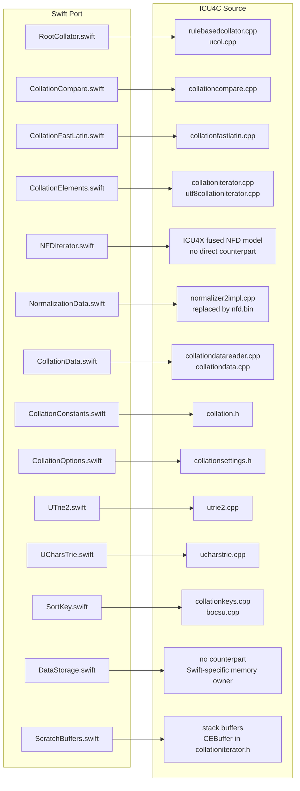
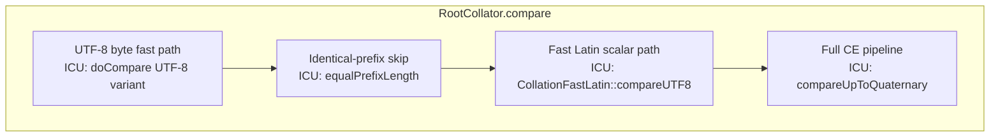
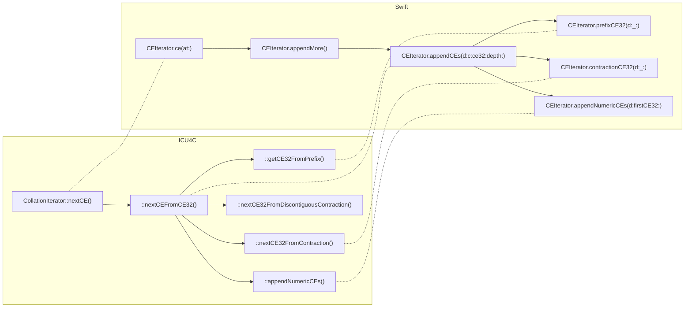
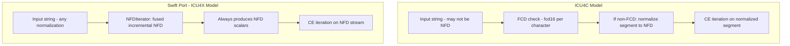
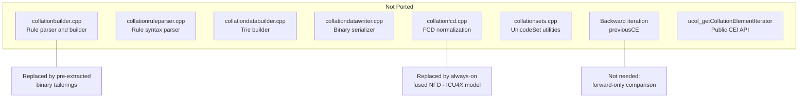
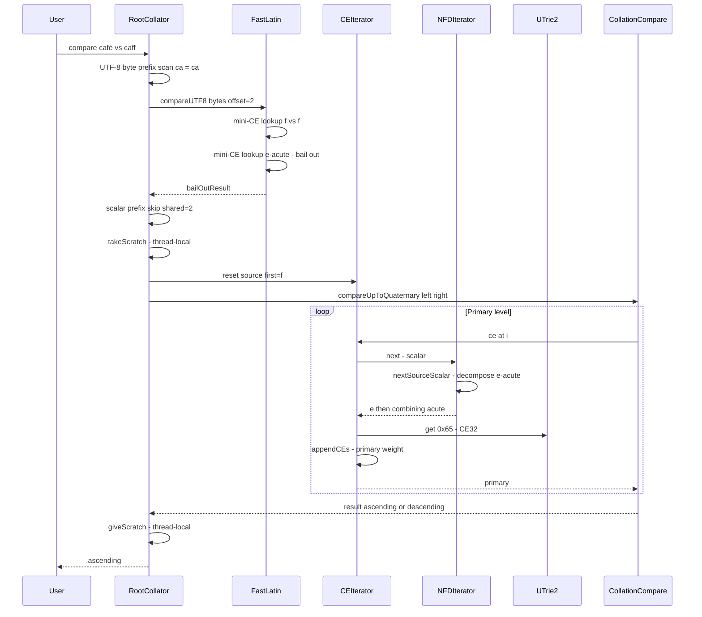

# ICU4C → Swift Port: Source Mapping

> A comprehensive map of how the ICU4C collation implementation was ported
> to this Swift library, showing the relationship between C source files,
> APIs, and functions on both sides.

## 1. High-Level Architecture Diagram

## 2. Detailed File-to-File Mapping

| Swift File | ICU4C Source | Role |
|---|---|---|
| `CollationConstants.swift` | `collation.h` | CE32/CE bit layouts, tag enum, implicit primaries |
| `CollationData.swift` | `collationdatareader.h/.cpp`, `collationdata.h` | Binary data parser, trie/array accessors |
| `CollationElements.swift` | `collationiterator.h/.cpp`, `utf8collationiterator.h/.cpp` | CE generation, tag dispatch, contractions, prefixes |
| `CollationCompare.swift` | `collationcompare.h/.cpp` | Level-by-level CE comparison |
| `CollationFastLatin.swift` | `collationfastlatin.h/.cpp` | Mini-CE fast path for Latin text |
| `CollationOptions.swift` | `collationsettings.h/.cpp` | Strength, alternate, caseFirst, numeric, etc. |
| `SortKey.swift` | `collationkeys.h/.cpp`, `bocsu.h/.cpp` | Sort key generation + BOCSU identical level |
| `RootCollator.swift` | `rulebasedcollator.h/.cpp`, `ucol.cpp` | Public API, fast path orchestration |
| `UTrie2.swift` | `utrie2.h/.cpp` | Code-point-to-value lookup trie |
| `UCharsTrie.swift` | `ucharstrie.h/.cpp` | String-sequence-to-value trie |
| `NFDIterator.swift` | *(ICU4X model, no direct counterpart)* | Fused incremental NFD front end |
| `NormalizationData.swift` | `normalizer2impl.h` *(replaced)* | Single-trie nfd.bin: ccc + decomposition |
| `DataStorage.swift` | *(Swift-specific)* | Owns allocated memory behind UnsafeBufferPointers |
| `ScratchBuffers.swift` | `CEBuffer[40]` in `collationiterator.h` | Thread-local reusable per-call buffers |
| ❌ Not ported | `collationbuilder.h/.cpp`, `collationruleparser.h/.cpp` | Rule compilation — replaced by pre-extracted binaries |

## 3. Function-Level Mapping

### 3.1 Public API Layer

| ICU4C | Swift | Notes |
|-------|-------|-------|
| `ucol_strcollUTF8()` | `RootCollator.compare(_:_:options:)` | UTF-8 entry point; Swift receives `String` |
| `ucol_getSortKey()` | `RootCollator.sortKey(for:options:)` | Returns `[UInt8]` (ICU writes to caller buffer) |
| `ucol_open(locale)` | `RootCollator(tailoringNamed:)` | Loads bundled binary tailoring |
| `ucol_open("root")` | `RootCollator()` | Default root collator |
| `ucol_setAttribute()` | `CollationOptions` struct | Options are per-call, not per-collator |
| `ucol_setReorderCodes()` | `Reordering` (in tailoring data) | Data-supplied only, no runtime API |

### 3.2 Comparison Engine

| ICU4C Function | Swift Function | File |
|----------------|---------------|------|
| `RuleBasedCollator::doCompare()` | `RootCollator.compare()` | RootCollator.swift |
| — byte-level prefix scan | `fastLatinUTF8()` (static) | RootCollator.swift |
| — scalar prefix skip | inline in `compare()` (lines 149–165) | RootCollator.swift |
| `CollationFastLatin::compareUTF8()` | `CollationFastLatin.compareUTF8(...)` | CollationFastLatin.swift |
| `CollationFastLatin::compareKeys()` | `CollationFastLatin.compare(...)` | CollationFastLatin.swift |
| `CollationFastLatin::getOptions()` | `CollationFastLatin.getOptions(...)` | CollationFastLatin.swift |
| `CollationCompare::compareUpToQuaternary()` | `CollationCompare.compareUpToQuaternary(...)` | CollationCompare.swift |

### 3.3 CE Generation

| ICU4C Function | Swift Function | Notes |
|----------------|---------------|-------|
| `CollationIterator::nextCE()` | `CEIterator.ce(at:)` | Lazy: generates on demand |
| `CollationIterator::appendCEsFromCE32()` | `CEIterator.appendCEs(d:c:ce32:depth:)` | Tag dispatch loop |
| `CollationIterator::getCE32FromPrefix()` | `CEIterator.prefixCE32(d:_:)` | UCharsTrie walk on prev1/prev2 |
| `CollationIterator::nextCE32FromContraction()` | `CEIterator.contractionCE32(d:_:)` | Longest match + S2.1 discontiguous |
| `CollationIterator::nextCE32FromDiscontiguousContraction()` | (inlined in `contractionCE32`) | Combined into one function |
| `CollationIterator::appendNumericCEs()` | `CEIterator.appendNumericCEs(d:firstCE32:)` | CODAN digit runs |
| `CollationIterator::appendNumericSegmentCEs()` | `CEIterator.appendNumericSegmentCEs(d:_:)` | Per-segment encoding |
| `UTF8CollationIterator::nextCodePoint()` | `NFDIterator.next()` | NFD fused front end replaces raw iteration |
| `CollationIterator::CEBuffer` | `CEIterator.ces: [Int64]` | Growable array vs fixed 40-element + overflow |

### 3.4 Normalization (Architectural Divergence)

| ICU4C | Swift | Notes |
|-------|-------|-------|
| `Normalizer2Impl` (common/) | `NormalizationData` | Custom single-trie `nfd.bin` format |
| FCD16 check + segment normalize | `NFDIterator.next()` | Always-on fused NFD, no FCD |
| `normalizer2impl.h: getDecomposition()` | `NormalizationData.appendDecomposition(of:to:)` | Single trie lookup |
| `normalizer2impl.h: getCCC()` | `NormalizationData.ccc(_:)` | Packed in same trie value |
| Canonical ordering (within normalizer) | `NFDIterator.flushMarks()` | Insertion sort by ccc |
| No direct counterpart | `NormalizationData.isInert(_:)` | Fast-path: bare starters skip buffering |

### 3.5 Sort Keys

| ICU4C Function | Swift Function | Notes |
|----------------|---------------|-------|
| `CollationKeys::writeSortKeyUpToQuaternary()` | `CollationKeys.writeSortKeyUpToQuaternary(...)` | Faithful port with compression |
| `SortKeyByteSink` | `inout [UInt8]` + `SortKeyLevelBuffers` | No abstract sink; direct arrays |
| `SortKeyLevel` (internal class) | `SortKeyLevel` (struct) | Per-level byte accumulator |
| `BOCSU::writeIdenticalLevelRun()` | `CollationKeys.writeIdenticalLevelRun(...)` | BOCSU encoding for identical level |
| `BOCSU::writeDiff()` | `CollationKeys.writeDiff(_:into:)` | Single code-point diff encoding |

### 3.6 Trie Infrastructure

| ICU4C | Swift | Notes |
|-------|-------|-------|
| `UTRIE2_GET32(trie, c)` macro | `UTrie2.get(_ c: UInt32) -> UInt32` | `@inline(__always)`, same algorithm |
| `utrie2_fromBinary()` | `UTrie2.init(bytes:offset:length:storage:)` | Parse serialized format |
| `UCharsTrie::first()` | `UCharsTrie.first(_:)` | Start traversal |
| `UCharsTrie::next()` | `UCharsTrie.next(_:)` | Continue traversal |
| `UCharsTrie::nextForCodePoint()` | `UCharsTrie.nextForCodePoint(_:)` | Handle supplementary as surrogate pair |
| `UCharsTrie::getValue()` | `UCharsTrie.getValue()` | Read current value |

### 3.7 Data Loading

| ICU4C | Swift | Notes |
|-------|-------|-------|
| `CollationDataReader::read()` | `CollationData.init(bytes:)` | Parse ucadata.icu format |
| `CollationRoot::getRoot()` | `CollationData.root()` | Load bundled root binary |
| `ucol_open(locale)` loads .res | `CollationData.tailoring(named:)` | Bundled pre-extracted binaries |
| Stack buffers / `CEBuffer[40]` | `ScratchBuffers` + `ThreadLocalScratch` | Thread-local reuse instead of stack |

## 4. What Was NOT Ported (by design)

| ICU4C Component | Why Not Ported | Alternative |
|-----------------|---------------|-------------|
| `CollationBuilder` | Runtime rule compilation too complex for initial port | Binary tailorings from ICU build tools |
| `CollationRuleParser` | Only needed by builder | — |
| `CollationDataBuilder` | Only needed by builder | — |
| FCD check / `CollationFCD` | ICU4X architectural decision: always normalize | Fused NFD front end |
| Backward iteration (`previousCE()`) | Forward-only comparison is sufficient | — |
| Canonical closure in data | ICU4X model: NFD in iterator, not in data | Simpler data, correct via NFD |
| Unpaired surrogate handling | Swift `String` cannot contain them | — |
| `ucol_getCollationElementIterator` (public) | No public CE iterator API needed | Internal `collationElements(of:)` test hook |

## 5. Data Flow: A Compare Call

## 6. Summary Table

| Layer | ICU4C Files | Swift File | Key Difference |
|-------|------------|------------|----------------|
| **API** | rulebasedcollator, ucol | RootCollator | Value-type struct, options per-call |
| **Fast Path** | collationfastlatin | CollationFastLatin | Same algorithm, static functions |
| **Compare** | collationcompare | CollationCompare | Identical logic |
| **CE Iteration** | collationiterator, utf8/16collationiterator | CollationElements | Single struct, no inheritance |
| **Normalization** | normalizer2impl + FCD | NFDIterator + NormalizationData | Fused NFD, no FCD (ICU4X model) |
| **Constants** | collation.h | CollationConstants | Same bit layouts |
| **Options** | collationsettings | CollationOptions | Public value type |
| **Data** | collationdata + datareader | CollationData | UnsafeBufferPointer views |
| **Sort Keys** | collationkeys + bocsu | SortKey | Same compression algorithm |
| **Tries** | utrie2, ucharstrie | UTrie2, UCharsTrie | Read-only, same lookup |
| **Memory** | stack buffers, CEBuffer[40] | DataStorage, ScratchBuffers | Heap + thread-local reuse |
| **Builder** | collationbuilder + ruleparser | ❌ Not ported | Pre-extracted binaries |
