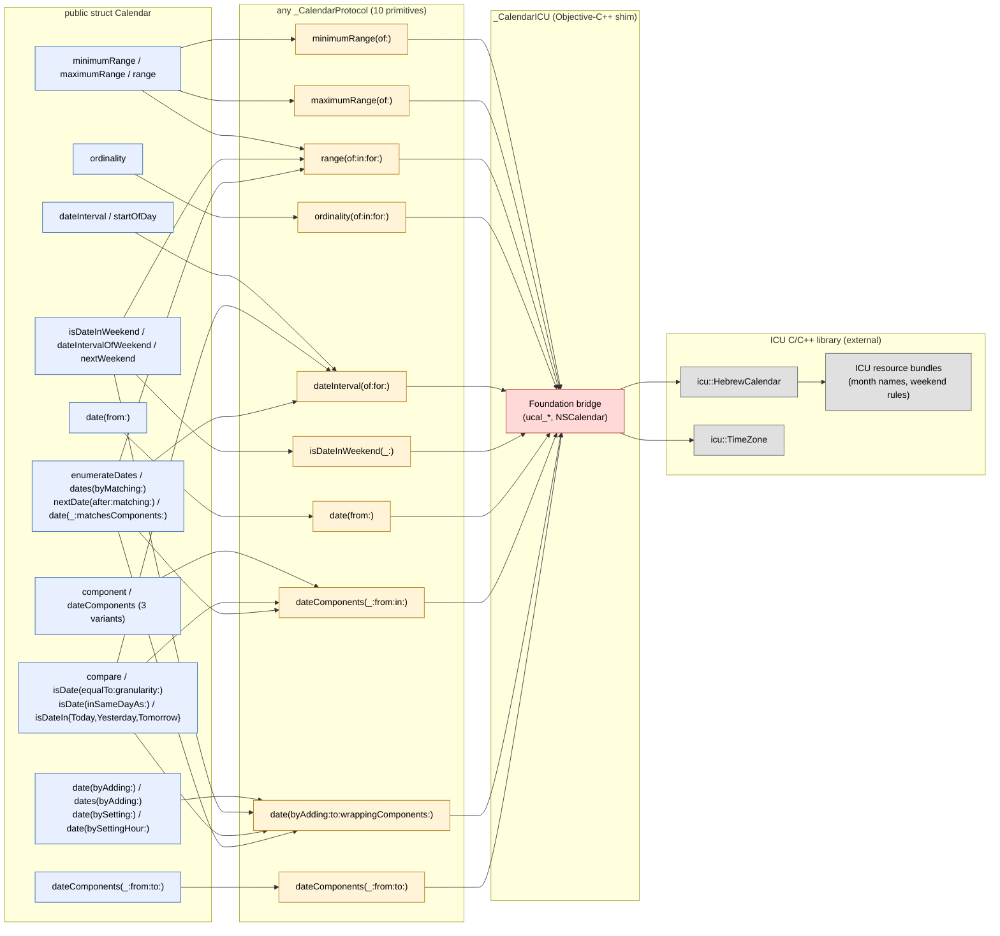
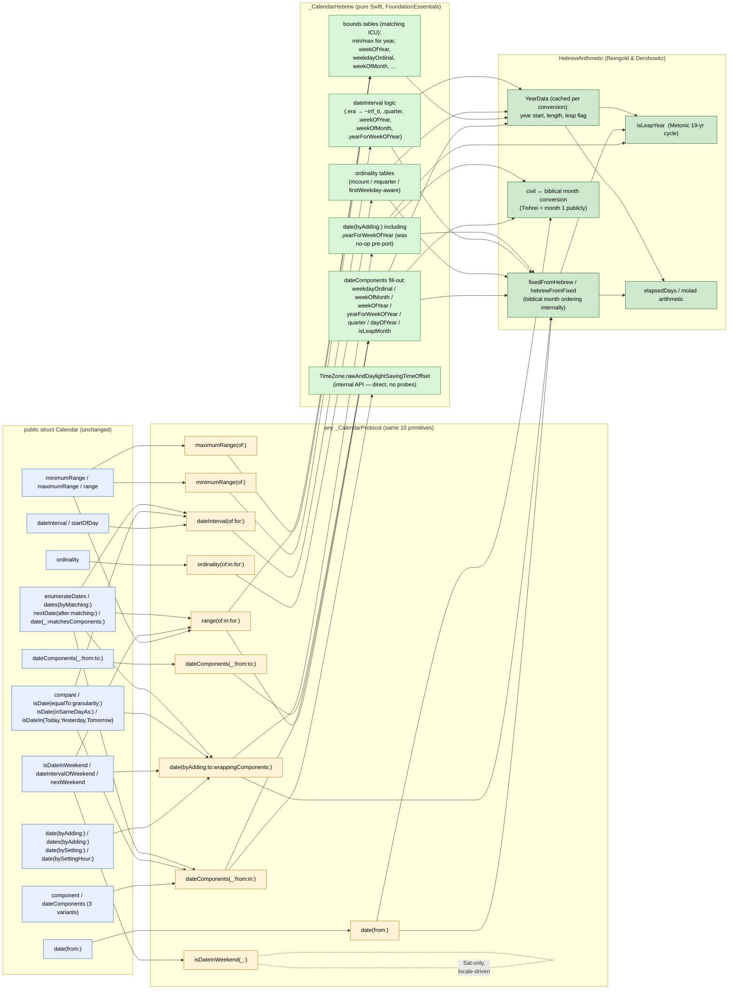

# Hebrew calendar — architecture before & after

How the public `Calendar` API gets answered for `.hebrew` — old (ICU-backed)
vs new (pure-Swift `_CalendarHebrew`).

The shape of the dispatch is identical: `Calendar` (public struct) holds an
`any _CalendarProtocol` and forwards every observable surface through the
same ~10 primitives. The port replaced the *implementation* behind that
protocol, not the protocol itself.

---

## Old architecture — `_CalendarICU(.hebrew)`

**Characteristics**

- Every primitive crossed an Objective-C++ bridge into ICU's C/C++ calendar code.
- `Calendar(.hebrew)` carried the cost of allocating an `icu::Calendar`
  per instance and round-tripping `UDate` (ms-since-1970 double) for every
  query.
- Behavior was defined by ICU. Any future ICU upgrade could shift edge
  cases (e.g. `.weekOfYear` for Adar II boundaries) silently.

---

## New architecture — `_CalendarHebrew` (pure Swift)

**Characteristics**

- No process-out call. Every primitive is value-typed Swift down to RataDie
  (fixed-day) arithmetic.
- `_CalendarHebrew` is a class but final and pinned per-instance; arithmetic
  is `Sendable` and lock-free.
- UTC↔local boundaries match `_CalendarGregorian` exactly: extraction uses
  `secondsFromGMT(for:)`, construction uses `rawAndDaylightSavingTimeOffset(for:repeatedTimePolicy:)`
  (skipped policy not passed through, matching Gregorian's call shape).
- Behavior is pinned by parity probes (Suite A + Suite B), the Hebcal
  regression, and direct policy-parity tests. Future ICU changes can no
  longer move our edge cases.

---

## What changed at the seams

| Seam | Old | New |
|---|---|---|
| `_CalendarProtocol` shape | unchanged | unchanged |
| Router (`_calendarClass(.hebrew)`) | `_CalendarICU.self` | `_CalendarHebrew.self` |
| Per-call cost | ObjC++ bridge + ICU `UDate` round-trip | Swift inline arithmetic |
| DST handling | ICU + Foundation `TimeZone` | internal `rawAndDaylightSavingTimeOffset` |
| Source of truth for edge cases | ICU resource bundles | `HebrewArithmetic` + parity probes |
| Tested observable surface | implicit (whatever ICU did) | 10 primitives + ~25 public methods, ~300 dates × 13 topics in both Suite A (protocol) and Suite B (public API) + DST policy parity (64 cases) + locale variations (6 configs) + Hebcal 73k-day regression + full Foundation suite (1510 tests) — all green |

The crucial property: **the public `Calendar` API and the `_CalendarProtocol`
are the same in both diagrams.** The port is a swap of the leaf
implementation behind the protocol. Every call site outside
`Sources/FoundationEssentials/Calendar/Calendar_Cache.swift` is unaware the
change happened — which is exactly what the parity protocol guarantees.
